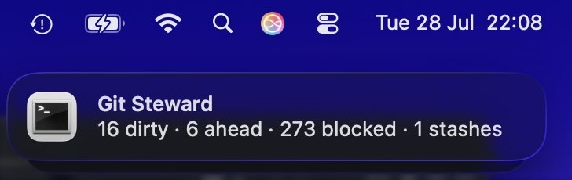

# Git Steward

[](LICENSE)
[]()
[]()
[]()



Local-first Git worktree hygiene, status dashboards, no-loss checkpointing, and dev server lifecycle management.

```bash
pip install git+https://github.com/alfaruqstories/git-steward.git
git-steward init --root ~/Code
git-steward scan --dashboard
```

## Features

- **Scan** — discover repos under configured roots, report branch, dirty/untracked/stashed state, ahead/behind counts. Optional macOS notification with results (`--notify`).
- **Dashboard** — local HTML dashboard rendered from scan data, auto-refreshes every 60s.
- **Serve** — live HTTP server serving the dashboard with API endpoints, port detection for running dev servers, and optional background re-scanning.
- **Checkpoint** — guarded local checkpoint commits for dirty repos (never pushes)
- **History** — SQLite timeline of scans, blockages, checkpoints
- **Safe by default** — skips active Git operations, secret-looking untracked paths, quarantined repos; never pushes

## Install

```bash
pip install git+https://github.com/alfaruqstories/git-steward.git
```

Or from a local clone:

```bash
git clone https://github.com/alfaruqstories/git-steward
cd git-steward
pip install -e .
```

Requires Python 3.11+.

## Quick Start

```bash
# Create a config that scans ~/Code (depth 3 for nested repos)
git-steward init --root ~/Code

# Scan all discovered repos and open the dashboard
git-steward scan --dashboard --notify

# Serve the dashboard live in your browser (auto-refresh, port detection)
git-steward serve --open

# See where config and state files live
git-steward where
```

Config lives at `~/.config/git-steward/config.toml` by default. State files go to `~/.local/state/git-steward/`.

## Usage

### Scanning

```bash
git-steward scan                          # scan and write latest.json + history.sqlite
git-steward scan --fetch                  # fetch remotes before ahead/behind checks
git-steward scan --dashboard              # also render dashboard.html
git-steward scan --notify                 # show macOS notification with results
```

### Dashboard

```bash
git-steward dashboard                     # render dashboard.html from latest scan
```

Open the generated HTML file in any browser. It shows a summary tile grid plus per-repo cards with branch, dirty count, ahead/behind, stashes, and blockers.

### Checkpointing

```bash
git-steward checkpoint --safe             # commit dirty work in every safe repo
git-steward checkpoint --safe --message "wip: before refactor"
```

Checkpointing is opt-in (`allow_checkpoint = true` in config). It skips repos with active Git operations, suspect untracked paths (`.env`, keys), and status errors.

### Live Dashboard Server

```bash
git-steward serve                         # start HTTP server on :8199
git-steward serve --port 8080             # custom port
git-steward serve --open                  # open dashboard in browser
git-steward serve --refresh 21600         # auto-scan every 6 hours (4x/day)
```

Serves the dashboard at `/` and provides API endpoints:

- `/api/latest.json` — latest scan data
- `/api/ports` — running dev servers detected (Vite, Next.js, Django, etc.)
- `/api/scan` — trigger an on-demand re-scan

Background re-scanning is opt-in via `--refresh` (default: off). Configure frequency in `config.toml` with `refresh_seconds = 43200` (2x/day).

### Scheduled Scanning (macOS)

```bash
git-steward install-launchagent --interval 3600
launchctl bootstrap gui/$(id -u) ~/Library/LaunchAgents/com.git-steward.scan.plist
```

The LaunchAgent runs `scan --dashboard --notify` on a timer. Notifications use `terminal-notifier` (click opens the live dashboard at `http://127.0.0.1:8199/`) or fall back to `osascript`.

### Menu Bar Integration (SwiftBar/xBar)

Copy `examples/swiftbar.git-steward.example.sh` to your SwiftBar plugins folder.

## Configuration

Reference: `examples/git-steward.config.example.toml`

```toml
version = 1
redact_paths = true
scan_timeout_seconds = 4
git_timeout_seconds = 4
scan_workers = 8
allow_checkpoint = false          # enable with caution
checkpoint_message = "chore: checkpoint local work"
refresh_seconds = 43200           # background scan interval (2x/day) for serve mode

[output]
state_dir = "~/.local/state/git-steward"

[[roots]]
path = "~/Code"
depth = 3

# Optional: scan specific repos outside roots
# [[repos]]
# path = "~/other-project"

archive_markers = ["/Archive/", "/Backups/", "all-repos"]
exclude_paths = []
quarantine_paths = []
```

## Safety

- Never pushes to any remote
- Skips repos during active merge/rebase/cherry-pick/bisect
- Blocks checkpointing on secret-looking paths (`.env`, `id_*`, `*.pem`, `*credentials*.json`)
- Quarantined repos are reported as blocked without being probed
- Paths are redacted in JSON and HTML output (default)
- State files use restricted permissions (0600)

## Development

```bash
git clone https://github.com/alfaruqstories/git-steward
cd git-steward
pip install -e .
pip install ruff mypy pre-commit   # or use pipx
pre-commit install                  # hooks run ruff + mypy
python3 -m pytest tests/
```

## License

MIT

## Contributing

Issues and pull requests welcome at [alfaruqstories/git-steward](https://github.com/alfaruqstories/git-steward).
